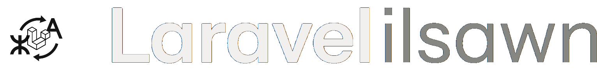
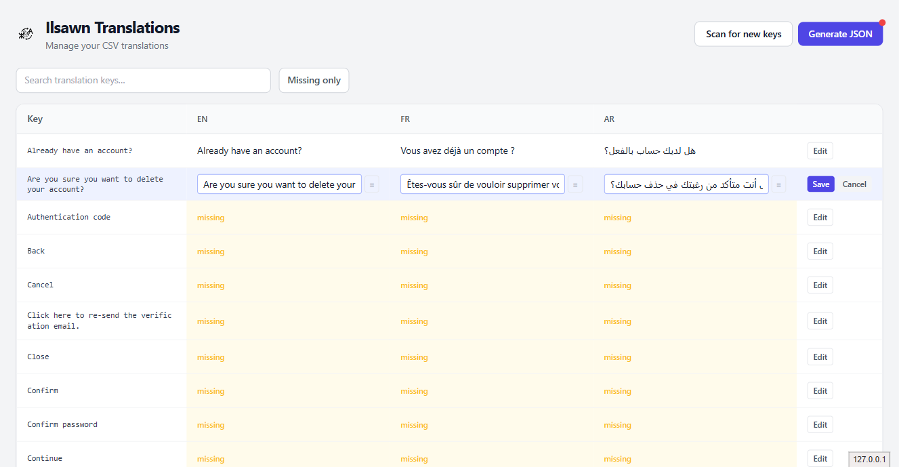
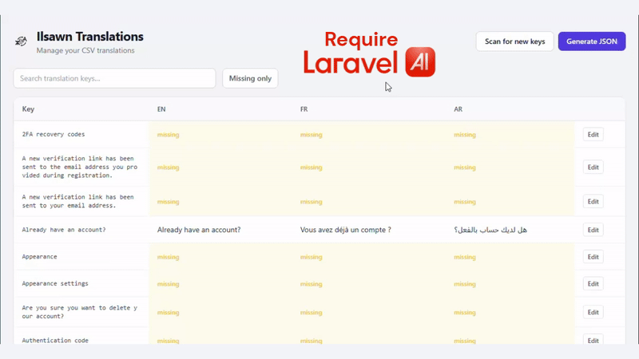

<p align="center"></p>

A Laravel package to manage multilingual translations through a single CSV file.
Comes with a Livewire management UI, an Inertia.js integration, and JS adapters for React, Vue 3, and Svelte.

> **ilsawn** (ⵉⵍⵙⴰⵡⵏ) — from the Amazigh word **ⵉⵍⵙ** (_ils_), meaning _language_ or _tongue_.
> The plural **ⵉⵍⵙⴰⵡⵏ** carries both senses: the organ of speech, and a people's idiom.

---

<p align="center"></p>

## Features

- **One CSV, all locales** — every translation lives in a single human-readable file
- **Livewire UI** — browse, search, and edit translations inline from the browser
- **Artisan commands** — scan your codebase for missing keys, remove stale ones, generate JSON files
- **Inertia.js support** — `SharesTranslations` trait pushes the active locale to the frontend automatically, with production caching built in
- **JS adapters** — thin wrappers for React, Vue 3, and Svelte that expose the familiar `__()` helper
- **AI auto-translation** — one-click translation powered by `laravel/ai` (optional)
- **Safe fallback chain** — missing locale → default locale → key itself; the app never breaks

---

## Requirements

- PHP 8.2+
- Laravel 11, 12, or 13
- Livewire 3 or 4

---

## Installation

```bash
composer require yazidkhaldi/laravel-ilsawn
php artisan ilsawn:install
```

The install command:

1. Publishes `config/ilsawn.php`
2. Creates `lang/ilsawn.csv` with a header row for your configured locales
3. Publishes `app/Providers/IlsawnServiceProvider.php` where you control who can access the UI
4. If Inertia.js is detected: publishes the JS adapters to `resources/js/vendor/ilsawn/` and prints setup instructions

Then register the provider in `bootstrap/providers.php`:

```php
App\Providers\IlsawnServiceProvider::class,
```

---

## Publishing assets

All assets are published automatically by `ilsawn:install`. The tags below are only needed if you want to **re-publish or customise** individual pieces after installation.

| Tag | What gets published | Destination |
|---|---|---|
| `ilsawn-config` | Package config file | `config/ilsawn.php` |
| `ilsawn-views` | Livewire UI views | `resources/views/vendor/ilsawn/` |
| `ilsawn-js` | JS adapters (React, Vue, Svelte, Blade) | `resources/js/vendor/ilsawn/` |

```bash
php artisan vendor:publish --tag=ilsawn-config
php artisan vendor:publish --tag=ilsawn-views
php artisan vendor:publish --tag=ilsawn-js
```

Add `--force` to overwrite files that were already published.

---

## Configuration

`config/ilsawn.php`:

```php
return [
    // Locales your app supports — each becomes a column in the CSV
    'locales'        => ['en', 'fr', 'ar'],

    // Primary fallback locale when a translation is missing
    'default_locale' => 'en',

    // Path to the CSV file, relative to base_path()
    'csv_path'       => 'lang/ilsawn.csv',

    // Automatic CSV backup before every generate run
    'backup'         => true,
    'backup_limit'   => 5,   // 0 = keep all backups

    // Column delimiter — semicolon avoids conflicts with commas in text
    'delimiter'      => ';',

    // Directories scanned for translation keys (relative to base_path())
    'scan_paths'     => ['app', 'resources'],

    // Paths excluded from scanning
    'scan_exclude'   => ['resources/js/vendor/ilsawn'],

    // URL prefix for the management UI  →  /ilsawn
    'route_prefix'   => 'ilsawn',

    // Middleware applied to UI routes
    'middleware'     => ['web'],
];
```

---

## The CSV file

```csv
key;en;fr;ar
dashboard.title;Dashboard;Tableau de bord;لوحة القيادة
welcome;Welcome :name;Bienvenue :name;مرحبا :name
```

- **key** — any string: plain text, dot notation, snake_case, or a full sentence
- **locale columns** — one per locale listed in `config('ilsawn.locales')`
- **`:placeholder`** — use `:name` syntax for variable substitution in both PHP and JS

Edit this file directly, or use the Livewire UI at `/ilsawn`.

---

## Working with multiple locales

### Laravel's built-in lang files

When you run `php artisan lang:publish`, Laravel creates `lang/en/` with four files:

```
lang/en/auth.php
lang/en/pagination.php
lang/en/passwords.php
lang/en/validation.php
```

For each additional locale, the best practice is to **clone those files** into the matching folder and translate them:

```
lang/fr/auth.php
lang/fr/pagination.php
lang/fr/passwords.php
lang/fr/validation.php
```

Pre-translated versions for dozens of languages are available at:
**[github.com/Laravel-Lang/lang](https://github.com/Laravel-Lang/lang/tree/main/locales)**

Copy the files for your locales directly from that repository.

### Starter kit and package strings (Breeze, Jetstream…)

Some starter kits (e.g. Laravel Breeze) add strings that you may also want to translate —
dashboard labels, auth messages, etc.

**Laravel's native translator does NOT auto-load arbitrary JSON files from `lang/{locale}/`.**
For Blade and Livewire, only these sources are loaded automatically:

- `lang/{locale}/auth.php`, `pagination.php`, `passwords.php`, `validation.php` (PHP namespace files)
- `lang/{locale}.json` — the root-level JSON, which is exactly what ilsawn generates

So the correct workflow for those strings is: **add them to the CSV**.
ilsawn will generate `lang/fr.json`, `lang/ar.json`, etc., and Laravel will pick them up natively.

> **Inertia.js note:** If you use the `SharesTranslations` trait, it also reads JSON files placed in
> `lang/{locale}/` (e.g. `lang/fr/breeze.json`) and merges them into the shared `translations` prop.
> This is Inertia-only — it does not affect Blade.

```
lang/fr.json   ← generated by ilsawn:generate — do not edit manually
```

### What ilsawn's CSV handles

ilsawn's scanner automatically **skips** any key it finds in Laravel's standard lang files:
- `lang/{locale}/auth.php`, `pagination.php`, `passwords.php`, `validation.php`
- `lang/{locale}/*.json` (read by Inertia's SharesTranslations)

The CSV therefore stays focused on **your project's own strings** — no noise from the framework.

---

## Artisan commands

### `ilsawn:generate`

Generates one JSON file per locale in `lang/` (e.g. `lang/en.json`, `lang/fr.json`).

```bash
php artisan ilsawn:generate
```

Run this whenever you edit the CSV to make changes available to the application.
It creates a timestamped CSV backup and clears the application cache automatically.

**Options:**

| Flag                  | Description                                                                 |
| --------------------- | --------------------------------------------------------------------------- |
| `--scan`              | Scan `scan_paths` for `__()` calls and add missing keys to the CSV          |
| `--cleanup`           | Prompt to remove keys that are no longer referenced in code                 |
| `--remove-duplicates` | Prompt to remove keys that already exist in Laravel's own `lang/` PHP files |
| `--dry-run`           | Preview all changes without modifying any file                              |

### `ilsawn:install`

Publish config, CSV stub, Gate provider, and JS adapters.
Safe to re-run with `--force` to overwrite already-published files.

---

## Using translations

### Blade & Livewire (PHP side)

Use Laravel's native `__()` helper — no change to your workflow:

```html
{{ __('dashboard.title') }} {{ __('welcome', ['name' => $user->name]) }}
```

### Blade + Alpine.js (JS side)

For projects that use Blade without Inertia, add the `@ilsawnTranslations` directive to your main layout. It outputs a `<script>` tag that inlines the current locale's translations into the page:

```html
<head>
    @ilsawnTranslations
</head>
```

Then import the adapter once in your JS entry file:

```js
import "@/vendor/ilsawn/adapters/blade";
```

That's it. `window.__` is now available globally, so Alpine.js inline expressions work without any extra setup:

```html
<span x-text="__('dashboard.title')"></span>
<span x-text="__('welcome', { name: 'Ali' })"></span>
```

Or import the function explicitly in any JS file:

```js
import { __ } from "@/vendor/ilsawn/adapters/blade";

__("dashboard.title"); // 'Dashboard'
__("welcome", { name: "Ali" }); // 'Welcome Ali'
```

### Inertia.js (server side)

Open `app/Http/Middleware/HandleInertiaRequests.php` and make two additions:

```php
// 1. Add the use statement inside the class
use ilsawn\LaravelIlsawn\SharesTranslations;

class HandleInertiaRequests extends Middleware
{
    use SharesTranslations; // ← add this

    public function share(Request $request): array
    {
        return [
            ...parent::share($request),
            'auth' => ['user' => $request->user()],
            // ... your existing shared props ...
            'translations' => $this->translations($request), // ← add this
        ];
    }
}
```

That's it. The trait provides the `translations()` method — no other changes needed.

In production the result is cached forever under `ilsawn_translations_{locale}` and invalidated automatically when `ilsawn:generate` runs.

### React

```jsx
import { useLang } from "@/vendor/ilsawn/adapters/react";

export default function Page() {
    const { __ } = useLang();

    return <h1>{__("dashboard.title")}</h1>;
}
```

### Vue 3

```jsx
<script setup>
import { useLang } from "@/vendor/ilsawn/adapters/vue";

const { __ } = useLang();
</script>

<template>
    <h1>{{ __("dashboard.title") }}</h1>
</template>
```

### Svelte

```jsx
<script>
import { useLang } from '@/vendor/ilsawn/adapters/svelte';

const { __ } = useLang();
</script>

<h1>{__('dashboard.title')}</h1>
```

### Variable substitution in JS

All adapters support `:placeholder` replacements, consistent with Laravel's PHP syntax:

```js
__("welcome", { name: "Ali" }); // 'Welcome Ali'
```

---

## Livewire UI

<p align="center"></p>

Visit `/ilsawn` (or your configured `route_prefix`) to access the translation manager.

| Feature             | Description                                                                                        |
| ------------------- | -------------------------------------------------------------------------------------------------- |
| Search              | Filter keys in real time                                                                           |
| Missing only        | Toggle to show only keys that have at least one empty locale — great for spotting gaps quickly     |
| Inline edit         | Click Edit on any row to update values directly in the browser                                     |
| `=` button          | Copy the key itself into a locale field — useful for brand names or terms that need no translation |
| AI button           | Auto-translate the source text into the target locale (requires `laravel/ai`)                      |
| Scan                | Detect new keys from your codebase and add them to the CSV without leaving the UI                  |
| Generate JSON       | Regenerate the JSON locale files; a red dot on the button signals the CSV has unsaved changes      |
| Pending keys banner | Shown on page load when keys exist in code that are not yet in the CSV                             |

---

## Authorization

`ilsawn:install` publishes `app/Providers/IlsawnServiceProvider.php`:

```php
Gate::define('viewIlsawn', function ($user) {
    return in_array($user->email, [
        'admin@example.com',
    ]);
});
```

Replace the closure body with any logic you need — role checks, environment guards, etc.
The UI returns 403 for anyone the gate denies.

---

## AI auto-translation (optional)

Install `laravel/ai`:

```bash
composer require laravel/ai
```

<p align="center"></p>

An **AI** button appears automatically in the edit row for each non-source locale.
It translates the source text into the target language using your configured AI provider.
No additional configuration inside ilsawn is needed.

---

## Fallback chain

When a translation is requested:

1. Look up the key in the active locale's JSON file
2. If missing, fall back to the `default_locale` value
3. If that is also empty, return the key itself

The app never throws — a missing translation degrades gracefully to the key string.

---

## License

MIT — see [LICENSE](LICENSE) for details.
